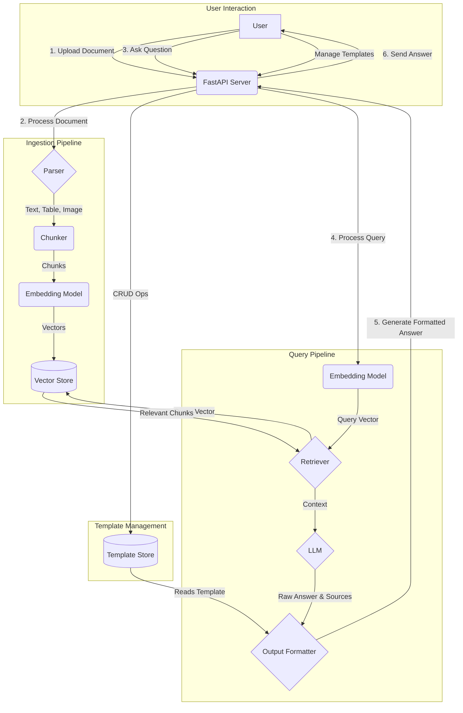

# 시스템 아키텍처

## 1. 개요

본 시스템은 사용자가 문서를 업로드하고 질문을 던지면, 문서의 내용을 벡터로 변환하여 저장하고, 질문과 가장 관련 높은 정보를 검색하여 LLM을 통해 답변을 생성하는 RAG 아키텍처를 따릅니다. 전체 프로세스는 크게 '데이터 수집(Ingestion)'과 '질의응답(Query)' 두 파이프라인으로 구성됩니다.

## 2. 주요 컴포넌트

- **API Server (FastAPI)**: 사용자와 시스템 간의 인터페이스 역할을 합니다. 문서 업로드, 질의응답 요청 등을 처리합니다.
- **문서 처리 파이프라인 (Data Ingestion Pipeline)**:
  1.  **문서 로더**: 업로드된 파일을 시스템으로 불러옵니다.
  2.  **파서 (Parser)**: `DataProcessing.md`에 기술된 전략에 따라 텍스트, 표, 이미지를 추출합니다.
  3.  **청커 (Chunker)**: 추출된 콘텐츠를 의미 있는 단위(Chunk)로 분할합니다.
  4.  **임베딩 모델 (Embedding Model)**: 각 청크를 벡터로 변환합니다. (예: Gemini)
  5.  **벡터 저장소 (Vector Store)**: 생성된 벡터와 원본 메타데이터를 저장하고 인덱싱합니다. (예: Supabase pgvector)
- **질의응답 파이프라인 (RAG Pipeline)**:
  1.  **쿼리 인코더**: 사용자의 질문을 벡터로 변환합니다. (예: Gemini)
  2.  **리트리버 (Retriever)**: 벡터 저장소에서 질문 벡터와 유사도가 높은 문서 청크들을 검색합니다.
  3.  **프롬프트 생성기**: 검색된 청크와 사용자 질문을 LLM이 이해하기 좋은 프롬프로 조합합니다.
  4.  **생성 모델 (Generator - LLM)**: 프롬프트를 기반으로 최종 답변을 생성합니다. (예: Gemini)
  5.  **출력 포맷터 (Output Formatter)**: LLM이 생성한 답변과 출처 정보를 사용자가 지정한 템플릿에 맞춰 가공합니다.
- **템플릿 저장소 (Template Store)**: 출력 포맷터가 사용하는 서식 템플릿을 저장하고 관리하는 데이터베이스입니다.

## 3. 시스템 흐름도 (Mermaid)



````

**3. `docs/API.md` 생성**

```markdown:docs/API.md
# API 명세서

## 1. 기본 정보

-   **Base URL**: `http://localhost:8000`
-   **인증**: 추후 API Key 기반 인증 도입 예정

## 2. Endpoints

---

### **`POST /upload`**

문서를 업로드하여 처리 파이프라인을 시작합니다.

-   **Description**: PDF 파일을 업로드하면 서버는 이를 비동기적으로 처리합니다.
-   **Request**:
    -   `Content-Type`: `multipart/form-data`
    -   `Body`:
        -   `file`: (file) 업로드할 PDF 파일
-   **Response (Success)**: `202 Accepted`
    ```json
    {
      "task_id": "some-unique-task-id",
      "doc_id": "unique-document-id",
      "message": "Document processing started."
    }
    ```

---

### **`GET /status/{task_id}`**

문서 처리 상태를 확인합니다.

-   **Description**: `/upload`에서 반환된 `task_id`로 처리 상태를 조회합니다.
-   **Request**:
    -   `Path Parameter`: `task_id` (string)
-   **Response (Success)**: `200 OK`
    ```json
    {
      "task_id": "some-unique-task-id",
      "status": "processing" // "pending", "processing", "completed", "failed"
    }
    ```

---

### **`POST /query`**

문서 내용에 대해 질의합니다.

-   **Description**: 사용자의 질문을 받아 RAG 파이프라인을 통해 답변을 생성합니다.
-   **Request**: `application/json`
    ```json
    {
      "query": "RIS 사업의 핵심 성공 요인은 무엇인가요?",
      "doc_id": "unique-document-id" // Optional: 특정 문서로 범위 한정
    }
    ```
-   **Response (Success)**: `200 OK`
    ```json
    {
      "answer": "RIS 사업의 핵심 성공 요인은 ... 입니다.",
      "sources": [
        {
          "doc_id": "unique-document-id",
          "page_number": 5,
          "content": "..."
        }
      ]
    }
    ```
````

**4. `docs/Development.md` 생성**

````markdown:docs/Development.md
# 개발 환경 설정

## 1. 사전 요구사항

-   Python 3.10 이상
-   Poetry (의존성 관리 도구)
-   Git

## 2. 설치 및 실행

1.  **저장소 클론**
    ```bash
    git clone <repository_url>
    cd rag-service
    ```

2.  **의존성 설치**
    ```bash
    poetry install
    ```

3.  **환경 변수 설정**
    -   `.env.example` 파일을 복사하여 `.env` 파일을 생성합니다.
    ```bash
    cp .env.example .env
    ```
    -   `.env` 파일 내에 필요한 API 키 및 설정 값을 입력합니다.
    ```env
    # .env
    OPENAI_API_KEY="sk-..."
    VECTOR_DB_PATH="./chroma_db"
    # ... other settings
    ```

4.  **개발 서버 실행**
    ```bash
    poetry run uvicorn app.main:app --reload
    ```
    이제 브라우저에서 `http://localhost:8000/docs` 로 접속하여 자동 생성된 Swagger UI를 확인할 수 있습니다.

## 3. 테스트 실행

```bash
poetry run pytest
````

````

**5. `docs/DataProcessing.md` 생성**

```markdown:docs/DataProcessing.md
# 문서 처리 파이프라인 상세 설계

## 1. 목표

RIS 전략 문서(PDF)의 내용을 **손실이나 왜곡 없이** 구조적으로 추출하여 RAG 성능을 극대화합니다. 텍스트, 표, 이미지를 개별적으로 인식하고 유의미한 메타데이터와 함께 처리하는 것을 목표로 합니다.

## 2. 처리 단계

### 단계 1: 문서 로드 (Document Loading)

-   `PyMuPDF` 라이브러리를 사용하여 PDF 파일을 페이지별로 로드합니다.
-   페이지 번호, 파일명 등 기본 메타데이터를 추출합니다.

### 단계 2: 레이아웃 분석 (Layout Analysis)

-   `unstructured.io` 라이브러리를 활용하여 각 페이지의 레이아웃을 분석합니다.
-   이를 통해 텍스트 블록, 표, 이미지 영역을 구분합니다. `unstructured`는 HTML과 유사한 형태로 구조를 반환하여 후처리에 용이합니다.

### 단계 3: 표(Table) 추출 및 변환

-   `unstructured`가 식별한 표 영역을 추출합니다.
-   추출된 표는 LLM이 쉽게 이해할 수 있도록 **Markdown 형식으로 변환**합니다.
-   변환된 Markdown 표는 원본 텍스트와 별도로, 'type: table'과 같은 메타데이터와 함께 저장됩니다.

### 단계 4: 이미지(Image) 처리

-   **옵션 A (Image Captioning):**
    -   페이지에서 식별된 이미지를 파일로 추출합니다.
    -   `BLIP`과 같은 이미지 캡셔닝 모델을 사용하여 이미지에 대한 설명을 생성합니다.
    -   생성된 캡션을 'type: image_summary' 메타데이터와 함께 텍스트 데이터로 저장합니다.
-   **옵션 B (Multimodal RAG - 심화):**
    -   이미지를 텍스트가 아닌 이미지 자체로 다룰 수 있는 멀티모달 모델(e.g., GPT-4o, LLaVA)을 활용하는 아키텍처를 고려합니다. 이 경우, 이미지와 텍스트 임베딩을 함께 처리하는 복잡한 로직이 필요합니다. (초기 단계에서는 옵션 A를 우선 적용)

### 단계 5: 청킹 (Chunking)

-   `RecursiveCharacterTextSplitter`를 사용하여 텍스트와 변환된 표(Markdown)를 청크로 분할합니다.
-   청킹 시, 논리적인 문단이 나뉘지 않도록 적절한 `chunk_size`와 `chunk_overlap`을 설정합니다.
-   각 청크는 **다음과 같은 풍부한 메타데이터를 포함**해야 합니다.
    ```json
    {
      "source_doc_id": "...",
      "page_number": 5,
      "content_type": "text" // or "table", "image_summary"
    }
    ```

## 3. 최종 데이터 구조

벡터 저장소에 저장되는 각 문서는 단순한 텍스트 조각이 아닌, 위와 같은 구조화된 메타데이터를 포함한 객체가 됩니다. 이를 통해 검색 시 더 정교한 필터링과 컨텍스트 제공이 가능해집니다.
````

이렇게 `docs` 디렉토리와 그 안에 5개의 핵심 설계 문서 생성을 완료했습니다. 다음 단계를 진행할 준비가 되었습니다. 무엇을 할까요?
